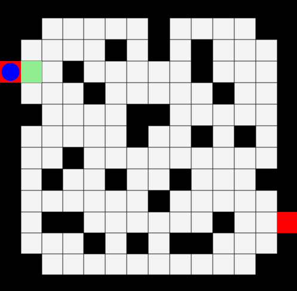

# Labirintus Golyó Navigátor

A feladat az hogy egy golyót kell elnavigálni a bal oldali piros mezőről a jobb oldali piros mezőre úgy, hogy csak előre vagy jobbra fordulva lehet lépni, és a fekete falakon nem lehet átmenni.

## Kezdeti állapot

A golyó a bal oldali piros mezőn kezdődik, a cél pedig a jobb oldali piros mező.

## Szabályok

- A golyó csak előre vagy jobbra fordulva léphet egy mezőt.
- A feketével jelölt falakat nem lehet átmenni.
- A cél a jobb oldali piros mező elérése.

## A megoldás lépései

TODO!